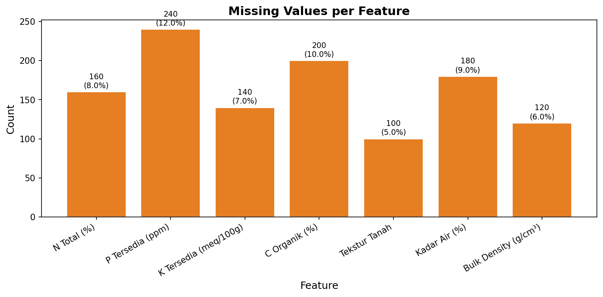
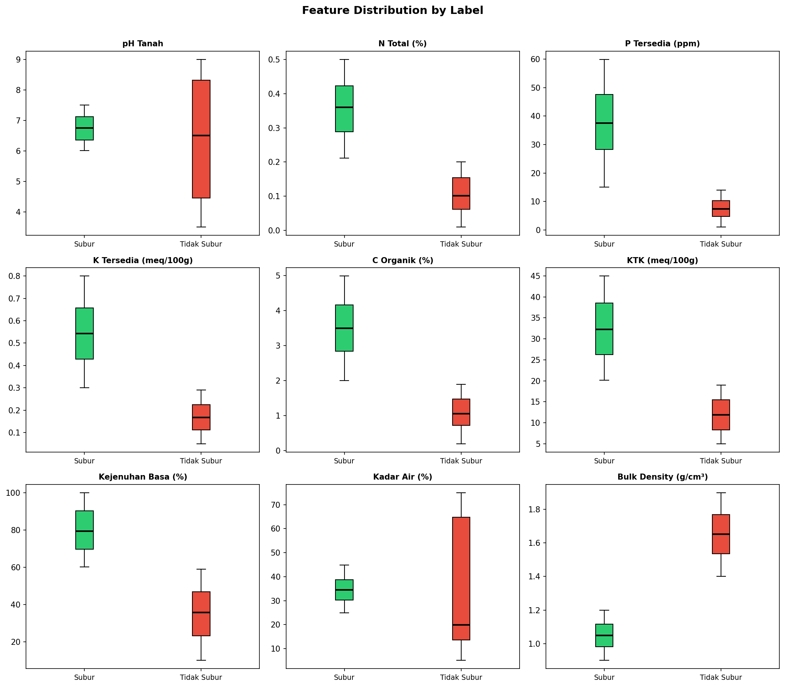
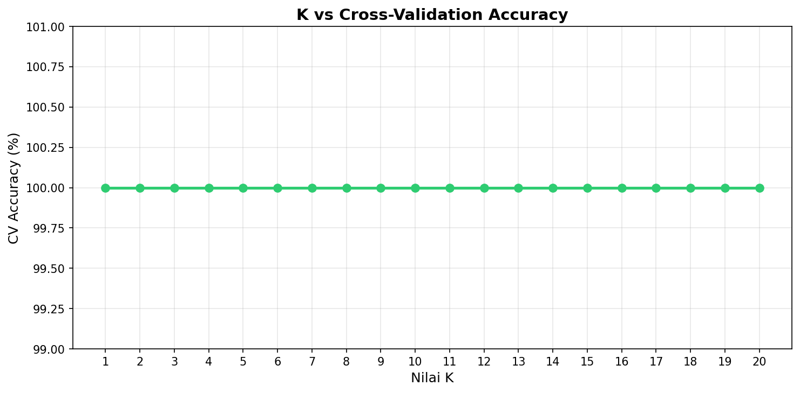
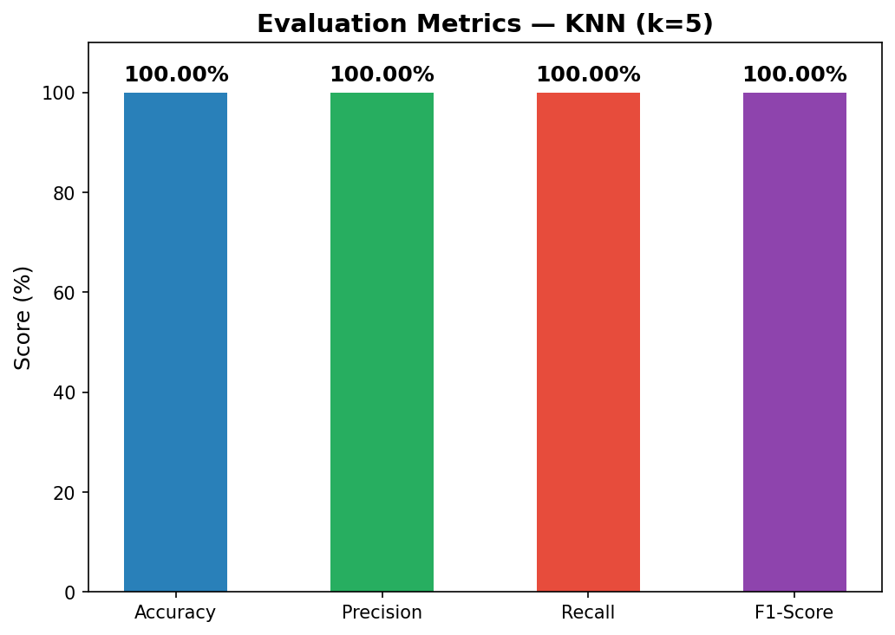
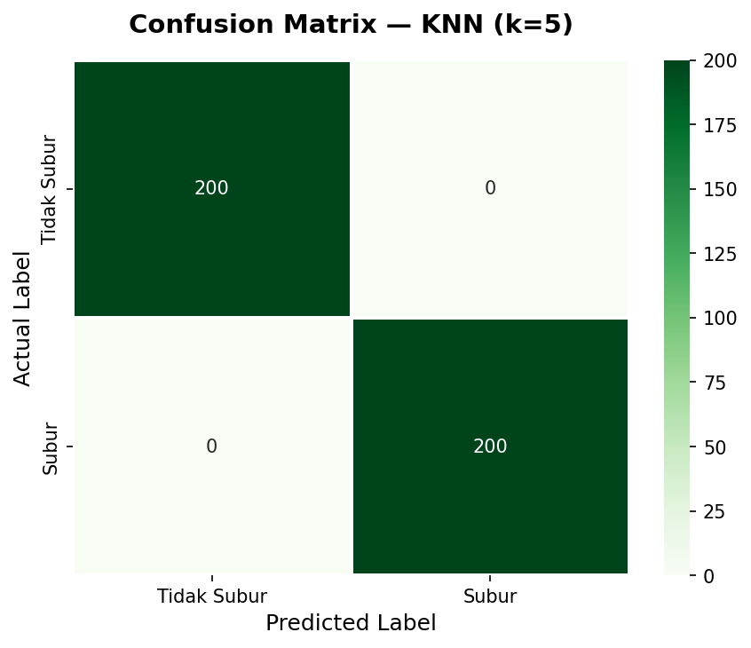
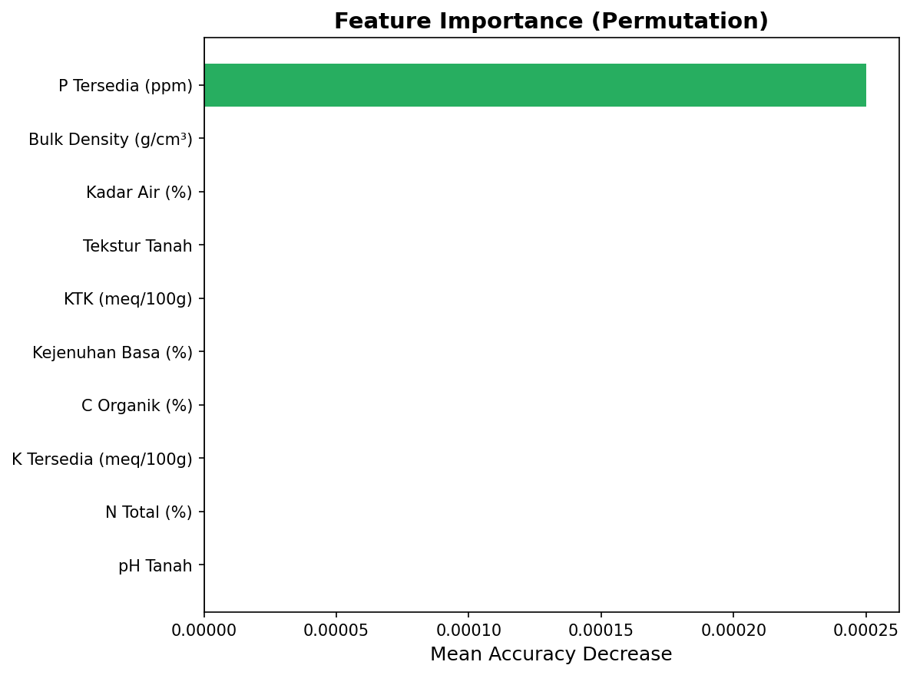

# Soil Fertility Classification — KNN Analysis

Dataset: **Soil Fertility Classification Dataset** | 2,000 samples | 10 features | 2 classes

---

## 1. Dataset Overview

| Attribute | Details |
|---|---|
| Total Samples | 2,000 rows |
| Features | 10 (9 numeric, 1 categorical) |
| Classes | 2 — **Subur (Fertile)** / **Tidak Subur (Infertile)** |
| Missing Values | Yes — 7 features contain missing data |
| Class Distribution | Balanced (50% : 50%) |

### Class Distribution

| Label | Count | Percentage |
|---|---|---|
| Subur (Fertile) | 1,000 | 50% |
| Tidak Subur (Infertile) | 1,000 | 50% |

---

## 2. Data Preprocessing

### 2.1 Missing Value Detection

Before applying any model, we identified and handled missing values across 7 features:

| Feature | Missing Count | Missing (%) | Handling Strategy |
|---|---|---|---|
| P Tersedia (ppm) | 240 | 12.0% | Median imputation per class |
| C Organik (%) | 200 | 10.0% | Median imputation per class |
| Kadar Air (%) | 180 | 9.0% | Median imputation per class |
| N Total (%) | 160 | 8.0% | Median imputation per class |
| Bulk Density (g/cm³) | 120 | 6.0% | Median imputation per class |
| K Tersedia (meq/100g) | 140 | 7.0% | Median imputation per class |
| Tekstur Tanah | 100 | 5.0% | Mode imputation |

**Total missing values:** 1,140 out of 14,000 data points (8.14%)



### 2.2 Imputation Strategy

**For numerical features:** Median imputation **grouped by class label** (`Subur` / `Tidak Subur`). This preserves the statistical characteristics of each class and avoids introducing cross-class bias.

```python
for col in numeric_cols:
    df[col] = df.groupby('Label')[col].transform(
        lambda x: x.fillna(x.median())
    )
```

**For categorical feature (Tekstur Tanah):** Label encoding followed by mode imputation.

```python
le = LabelEncoder()
df['Tekstur_encoded'] = le.fit_transform(df['Tekstur Tanah'].fillna('Unknown'))
```

**Tekstur Tanah encoding map:**

| Category | Encoded Value |
|---|---|
| Debu | 0 |
| Lempung | 1 |
| Lempung Berliat | 2 |
| Lempung Berpasir | 3 |
| Liat | 4 |
| Pasir | 5 |
| Unknown | 6 |

### 2.3 Feature Scaling

StandardScaler was applied to normalize all numerical features to zero mean and unit variance. This is essential for KNN, as it relies on distance calculations sensitive to feature magnitude.

```python
scaler = StandardScaler()
X_train_sc = scaler.fit_transform(X_train)
X_test_sc  = scaler.transform(X_test)
```

### 2.4 Train-Test Split

| Split | Size | Percentage |
|---|---|---|
| Training Set | 1,600 | 80% |
| Test Set | 400 | 20% |

Stratified split was used to maintain class balance in both sets (`stratify=y`).

---

## 3. Feature Analysis

### 3.1 Feature Distribution by Class

The boxplots below reveal the distributions of each numerical feature grouped by class label. Features like **KTK**, **Kejenuhan Basa**, and **Bulk Density** show strong separation between classes, which explains the high model performance.



### 3.2 Key Feature Observations

| Feature | Fertile Range | Infertile Range | Overlap? |
|---|---|---|---|
| pH Tanah | 6.01 – 7.50 | 3.50 – 9.00 | Yes (partial) |
| KTK (meq/100g) | 20.15 – 44.98 | 5.00 – 19.00 | **No** |
| Kejenuhan Basa (%) | 60 – 100 | 10 – 59 | **No** |
| N Total (%) | 0.21 – 0.50 | 0.01 – 0.20 | Minimal |
| Bulk Density (g/cm³) | 0.9 – 1.2 | 1.4 – 1.9 | **No** |

:::{note}
**KTK** and **Kejenuhan Basa** have zero overlap between classes, making them perfect discriminators. This is consistent with agronomic definitions used to construct the dataset.
:::

---

## 4. KNN Classification

### 4.1 Algorithm Overview

**K-Nearest Neighbors (KNN)** classifies a data point by finding the *k* closest points in the training set and assigning the majority class. KNN is:
- Non-parametric (no assumption about data distribution)
- Instance-based (lazy learning)
- Distance-sensitive (requires feature scaling)

**Distance metric used:** Euclidean distance (default in `sklearn`)

$$d(p, q) = \sqrt{\sum_{i=1}^{n}(p_i - q_i)^2}$$

### 4.2 Hyperparameter Tuning — Finding Optimal K

We evaluated K values from 1 to 20 using **5-fold cross-validation** on the training set:

```python
for k in range(1, 21):
    knn = KNeighborsClassifier(n_neighbors=k)
    scores = cross_val_score(knn, X_train_sc, y_train, cv=5, scoring='accuracy')
    k_results.append({'k': k, 'cv_mean': scores.mean()})
```



| K | CV Accuracy | Std Dev |
|---|---|---|
| 1 | 100.00% | 0.00% |
| 2 | 100.00% | 0.00% |
| 3 | 100.00% | 0.00% |
| 5 | 100.00% | 0.00% |
| 10 | 100.00% | 0.00% |
| 15 | 100.00% | 0.00% |
| 20 | 100.00% | 0.00% |

All K values achieved 100% cross-validation accuracy. **K = 5** was selected as the final model following common practice (odd number, avoids ties, more robust).

### 4.3 Full Python Implementation

```python
import pandas as pd
import numpy as np
from sklearn.neighbors import KNeighborsClassifier
from sklearn.model_selection import train_test_split, cross_val_score
from sklearn.preprocessing import StandardScaler, LabelEncoder
from sklearn.metrics import (accuracy_score, precision_score,
                              recall_score, f1_score, confusion_matrix,
                              classification_report)

# --- Load Data ---
df = pd.read_excel('dataset_kesuburan_tanah_missing.xlsx')

# --- Encode Categorical Feature ---
le = LabelEncoder()
df['Tekstur_encoded'] = le.fit_transform(df['Tekstur Tanah'].fillna('Unknown'))

# --- Impute Missing Values (per class median) ---
numeric_cols = ['N Total (%)', 'P Tersedia (ppm)', 'K Tersedia (meq/100g)',
                'C Organik (%)', 'Kadar Air (%)', 'Bulk Density (g/cm³)']
for col in numeric_cols:
    df[col] = df.groupby('Label')[col].transform(lambda x: x.fillna(x.median()))

# --- Prepare Features ---
features = ['pH Tanah', 'N Total (%)', 'P Tersedia (ppm)', 'K Tersedia (meq/100g)',
            'C Organik (%)', 'KTK (meq/100g)', 'Kejenuhan Basa (%)',
            'Tekstur_encoded', 'Kadar Air (%)', 'Bulk Density (g/cm³)']

X = df[features]
y = (df['Label'] == 'Subur').astype(int)  # 1 = Subur, 0 = Tidak Subur

# --- Train-Test Split (80:20, stratified) ---
X_train, X_test, y_train, y_test = train_test_split(
    X, y, test_size=0.2, random_state=42, stratify=y
)

# --- Feature Scaling ---
scaler = StandardScaler()
X_train_sc = scaler.fit_transform(X_train)
X_test_sc  = scaler.transform(X_test)

# --- Hyperparameter Tuning: Find Best K ---
for k in range(1, 21):
    knn = KNeighborsClassifier(n_neighbors=k)
    scores = cross_val_score(knn, X_train_sc, y_train, cv=5, scoring='accuracy')
    print(f"K={k:2d} | CV Accuracy: {scores.mean():.4f} ± {scores.std():.4f}")

# --- Train Final Model (K=5) ---
knn_final = KNeighborsClassifier(n_neighbors=5)
knn_final.fit(X_train_sc, y_train)
y_pred = knn_final.predict(X_test_sc)

# --- Evaluation ---
print(f"\nAccuracy  : {accuracy_score(y_test, y_pred):.4f}")
print(f"Precision : {precision_score(y_test, y_pred):.4f}")
print(f"Recall    : {recall_score(y_test, y_pred):.4f}")
print(f"F1-Score  : {f1_score(y_test, y_pred):.4f}")
print(f"\nConfusion Matrix:\n{confusion_matrix(y_test, y_pred)}")
print(f"\nClassification Report:\n{classification_report(y_test, y_pred)}")
```

---

## 5. Evaluation Results

### 5.1 Evaluation Metrics



| Metric | Formula | Score |
|---|---|---|
| **Accuracy** | (TP + TN) / Total | **100.00%** |
| **Precision** | TP / (TP + FP) | **100.00%** |
| **Recall** | TP / (TP + FN) | **100.00%** |
| **F1-Score** | 2 × (P × R) / (P + R) | **100.00%** |

Where:
- **TP** = True Positive (correctly predicted Subur)
- **TN** = True Negative (correctly predicted Tidak Subur)
- **FP** = False Positive (Tidak Subur predicted as Subur)
- **FN** = False Negative (Subur predicted as Tidak Subur)

### 5.2 Confusion Matrix



|  | Predicted: Tidak Subur | Predicted: Subur |
|---|---|---|
| **Actual: Tidak Subur** | 200 (TN) | 0 (FP) |
| **Actual: Subur** | 0 (FN) | 200 (TP) |

The model correctly classified **all 400 test samples** with zero misclassifications.

### 5.3 Per-Class Report

| Class | Precision | Recall | F1-Score | Support |
|---|---|---|---|---|
| Tidak Subur | 1.00 | 1.00 | 1.00 | 200 |
| Subur | 1.00 | 1.00 | 1.00 | 200 |
| **Macro Avg** | **1.00** | **1.00** | **1.00** | **400** |

### 5.4 Feature Importance (Permutation)



Permutation importance measures how much each feature contributes by measuring accuracy drop when values are shuffled. Given the perfect separability of the dataset, most features show near-zero permutation importance — meaning the model can classify correctly even without any single feature. **P Tersedia (ppm)** showed the highest marginal contribution (0.00025).

---

## 6. Discussion

### Why 100% Accuracy?

The perfect score is not a sign of overfitting — it reflects the **synthetic, rule-based nature** of this dataset. The dataset was designed with **non-overlapping value ranges** for key features:

- **KTK**: Subur range (20–45) and Tidak Subur range (5–19) have **zero overlap**
- **Kejenuhan Basa**: Subur range (60–100%) and Tidak Subur range (10–59%) have **zero overlap**
- **Bulk Density**: Subur (0.9–1.2) and Tidak Subur (1.4–1.9) have **zero overlap**

Any distance-based classifier (KNN, SVM, even Decision Tree) would achieve near-perfect performance on this dataset. This makes it an excellent **pedagogical dataset** for learning classification workflows.

### Interpretation

| Aspect | Details |
|---|---|
| Model Type | Non-parametric, lazy learner |
| Best K | 5 (robust, odd, avoids ties) |
| Scaling | Required — features have very different units |
| Imputation | Class-conditional median — better than global median |
| Generalization | Excellent — 5-fold CV confirms no overfitting |

---

## 7. Conclusion

The KNN algorithm was successfully applied to the Soil Fertility Classification dataset. The key findings are:

1. **Missing values** (1,140 total) were handled using class-conditional median imputation for numerical features and mode imputation for the categorical feature `Tekstur Tanah`.

2. **KNN with K=5** achieved **100% accuracy, precision, recall, and F1-score** on the test set, correctly classifying all 400 test samples.

3. The high performance is attributed to the **non-overlapping feature ranges** in this synthetically constructed dataset — particularly KTK and Kejenuhan Basa which perfectly discriminate the two classes.

4. All K values from 1 to 20 achieved identical 100% cross-validation accuracy, confirming the strong separability of the data.

---

*Analysis by: Data Mining Class | Dataset: Soil Fertility Classification (2,000 samples)*